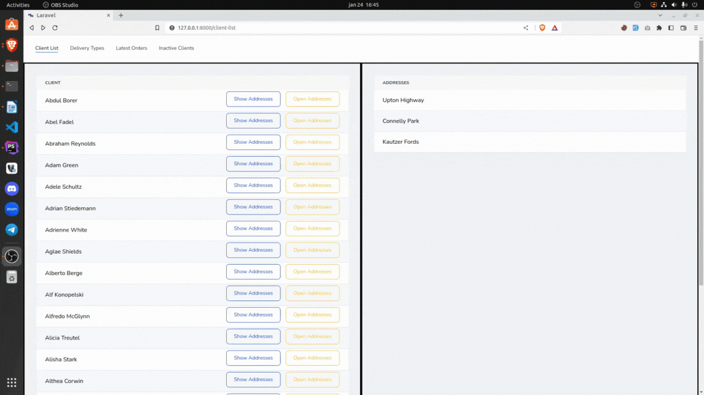
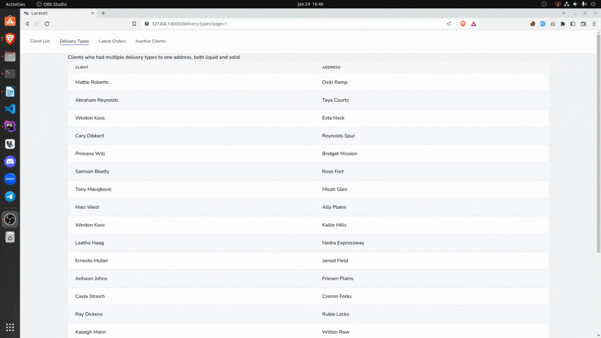

# Client list for a company

## Table of contents

* [General info](#general-info)
* [Demonstration GIFs](#demonstration-gifs)
* [Used Technologies](#used-technologies)
* [Setup](#setup)

## General info

4 Main pages - 
* Client deliveries
  * List of clients on the left side of the screen with buttons to: 
    * show a specific clients addresses on the right side and a button;
    * take the user to a page with information about deliveries for a specific client (client information shown on the top part of page and delivery information on the bottom).
* Delivery Types
  * Clients who had multiple delivery types to one address, both liquid and solid
* Latest Orders 
  * Orders listed in descending order by 'route' date
* Inactive Clients
  * Clients who have never been DELIVERED liquid product

## Demonstration GIFs

    <h3>Client deliveries page</h3>
    

         
    

    <h3>All other pages</h3>
    

         
    

## Used Technologies

* Laravel v9
* PHP 8.0
* MySQL

## Setup

To install this project on your local machine, follow these steps:

1. Clone this repository - `git clone https://github.com/guztus/Gas-Clients`
2. Install all dependencies - `composer install`
3. Rename the ".env.example" file to ".env"  
4. Create a database and add the credentials to the ".env" file
5. Run Laravel migrations `php artisan migrate`
6. Run Laravel seeder `php artisan db:seed`
7. Run the Laravel app `php artisan serve`
8. Run the frontend `npm run dev`
